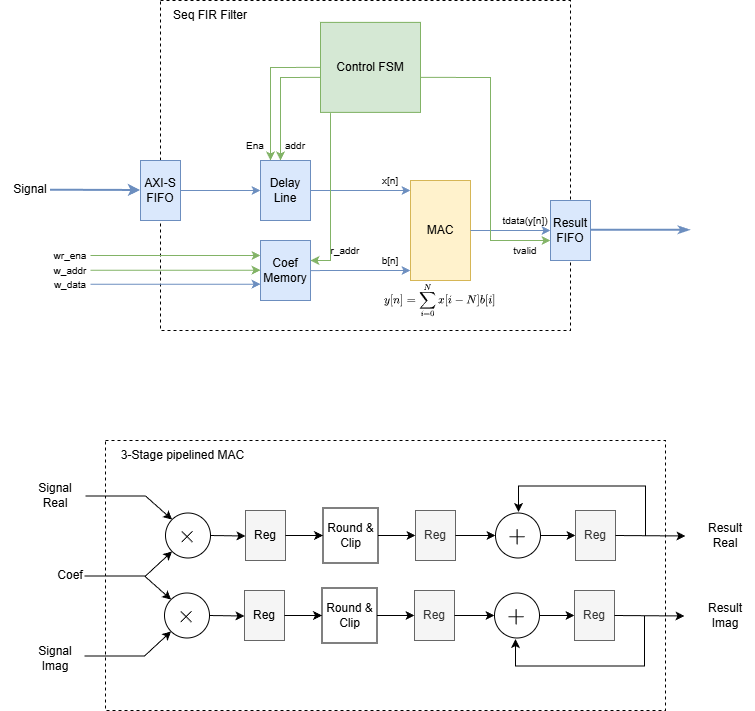

# rtl-fir-filter

На данный момент работа над проектом еще ведется в трех разных ветках:

- main: Ветка с состоянием проекта до начала оптимизации 
- pipeline-opt: Ветка с оптимизированным вычислительным модулем под блоки DSP48E1
- axil-integration: Ветка с подключением фильтра к AXI-Lite шине

## Схема фильтра



## Запуск тестов cocotb

```cmd
cd tb/filter_tb_py
python -m pytest test.py
```

**Windows:**

```cmd
cd tb/axil_filter_tb_py
set COCOTB_RESOLVE_X=zeros
python -m pytest test.py
```

**Linux:**

```bash
cd tb/axil_filter_tb_py
export COCOTB_RESOLVE_X="zeros"
python -m pytest test.py
```