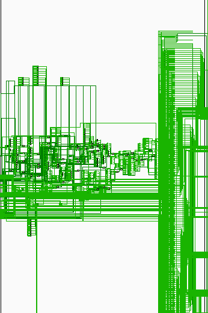
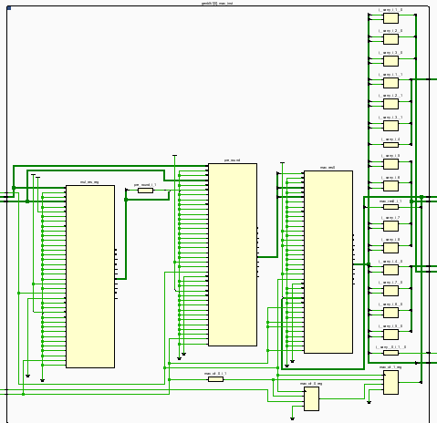

# Исследование имплементаций вычислительного ядра

## Цель исследования

Оценка аппаратных затрат, максимальной тактовой частоты и энергопотребления различных реализаций вычислительного ядра.

### Реализация полностью на логических ячейках

Для синтеза модуля полностью на логических ячейках используется аттрибут:

```verilog
(* use_dsp = "no" *)
```

В такой реализации модуль является вычислительным конвейером со стадиями:

1. Умножение
2. Округление
3. Сложение

Округление происходит до сложения, чтобы сэкономить аппаратные ресурсы, уменьшив разрядность сумматора.

<details>
  <summary> <b>Schematic</b> </summary>

  

</details>

<details>
  <summary> <b>Utilization Report</b> </summary>
  
```
7. Primitives
-------------

+----------+------+---------------------+
| Ref Name | Used | Functional Category |
+----------+------+---------------------+
| FDRE     | 6295 |        Flop & Latch |
| LUT6     | 2011 |                 LUT |
| MUXF7    |  816 |               MuxFx |
| LUT5     |  536 |                 LUT |
| MUXF8    |  384 |               MuxFx |
| LUT3     |  270 |                 LUT |
| LUT2     |  182 |                 LUT |
| RAMD64E  |  176 |  Distributed Memory |
| CARRY4   |  124 |          CarryLogic |
| LUT4     |  102 |                 LUT |
| LUT1     |   38 |                 LUT |
| FDCE     |   30 |        Flop & Latch |
| FDPE     |    2 |        Flop & Latch |
+----------+------+---------------------+
```

</details>


<details>
  <summary> <b>Timing Report</b> </summary>

```
    WNS(ns)      TNS(ns)  TNS Failing Endpoints  TNS Total Endpoints      WHS(ns)      THS(ns)  THS Failing Endpoints  THS Total Endpoints     WPWS(ns)     TPWS(ns)  TPWS Failing Endpoints  TPWS Total Endpoints  
    -------      -------  ---------------------  -------------------      -------      -------  ---------------------  ------------------  --------     --------  ----------------------  --------------------  
    -12.922   -12707.168                   5430                 9683        0.108        0.000                      0                 9683       -0.250      -44.000                     176                  6503  


Timing constraints are not met.

```

Значение Fmax вычисляется из значения Worst Negative Slack (WNS) по формуле:

$$F_{max} = \frac{1}{T_{clk} - WNS}$$

$$F_{max} = \frac{1}{(2 - (-12.922)) * 10^{-9}} = 67015145.423 Hz \approx 67.014 MHz$$

</details>

### Реализация с использованием DSP-блоков

Для того, чтобы синтезатор Vivado использовал DSP блоки при синтезе модуля необходимо объявить следующий аттрибут перед инстанцированием модуля.

```verilog
(* use_dsp = "yes" *)
```

Модуль также конвейеризирован и следует следующей схеме вычислений:

1. Умножение
2. Округление
3. Сложение

<details>
  <summary> <b>Schematic</b> </summary>

  

</details>

<details>
  <summary> <b>Utilization Report</b> </summary>

  ```
7. Primitives
-------------

+----------+------+---------------------+
| Ref Name | Used | Functional Category |
+----------+------+---------------------+
| FDRE     | 6155 |        Flop & Latch |
| LUT6     | 1662 |                 LUT |
| MUXF7    |  816 |               MuxFx |
| MUXF8    |  384 |               MuxFx |
| RAMD64E  |  176 |  Distributed Memory |
| LUT5     |  149 |                 LUT |
| LUT3     |  120 |                 LUT |
| LUT2     |   37 |                 LUT |
| LUT4     |   32 |                 LUT |
| FDCE     |   30 |        Flop & Latch |
| LUT1     |   11 |                 LUT |
| CARRY4   |   10 |          CarryLogic |
| DSP48E1  |    6 |    Block Arithmetic |
| FDPE     |    2 |        Flop & Latch |
+----------+------+---------------------+

  ```

</details>


<details>
  <summary> <b>Timing Report</b> </summary>
  
------------------------------------------------------------------------------------------------
| Design Timing Summary
| ---------------------
------------------------------------------------------------------------------------------------

    WNS(ns)      TNS(ns)  TNS Failing Endpoints  TNS Total Endpoints      WHS(ns)      THS(ns)  THS Failing Endpoints  THS Total Endpoints     WPWS(ns)     TPWS(ns)  TPWS Failing Endpoints  TPWS Total Endpoints  
    -------      -------  ---------------------  -------------------      -------      -------  ---------------------  -------------------     --------     --------  ----------------------  --------------------  
     -7.669   -13150.839                   5484                 9963        0.089        0.000                      0                 9963       -0.250      -44.616                     180                  6367  


Timing constraints are not met.

$$F_{max} = \frac{1}{(2 - (-7.669)) * 10^{-9}} = 103423311.614 Hz \approx 103 MHz$$

</details>

### Оптимизированная реализация на DSP-блоках

Исходя из вывода по синтезу предыдущей схемы была произведена оптимизация изменением порядка стадий конвейера:

1. Умножение
2. Сложение 
3. Округление

<details>
  <summary> <b>Schematic</b> </summary>

  

</details>

<details>
  <summary> <b>Utilization Report</b> </summary>

  ```
+----------+------+---------------------+
| Ref Name | Used | Functional Category |
+----------+------+---------------------+
| FDRE     | 6221 |        Flop & Latch |
| LUT6     | 1662 |                 LUT |
| MUXF7    |  816 |               MuxFx |
| MUXF8    |  384 |               MuxFx |
| RAMD64E  |  176 |  Distributed Memory |
| LUT2     |  173 |                 LUT |
| LUT5     |  148 |                 LUT |
| LUT3     |  122 |                 LUT |
| LUT4     |   33 |                 LUT |
| FDCE     |   30 |        Flop & Latch |
| CARRY4   |   14 |          CarryLogic |
| LUT1     |    7 |                 LUT |
| FDPE     |    2 |        Flop & Latch |
| DSP48E1  |    2 |    Block Arithmetic |
+----------+------+---------------------+
  ```

</details>


<details>
  <summary> <b>Timing Report</b> </summary>

```
------------------------------------------------------------------------------------------------
| Design Timing Summary
| ---------------------
------------------------------------------------------------------------------------------------

    WNS(ns)      TNS(ns)  TNS Failing Endpoints  TNS Total Endpoints      WHS(ns)      THS(ns)  THS Failing Endpoints  THS Total Endpoints     WPWS(ns)     TPWS(ns)  TPWS Failing Endpoints  TPWS Total Endpoints  
    -------      -------  ---------------------  -------------------      -------      -------  ---------------------  -------------------     --------     --------  ----------------------  --------------------  
     -5.324   -12622.654                   5570                 9865        0.109        0.000                      0                 9865       -0.545      -45.090                     178                  6495  

```

$$F_{max} = \frac{1}{(2 - (-5.324)) * 10^{-9}} = 136537411.251 Hz \approx 137 MHz$$

</details>